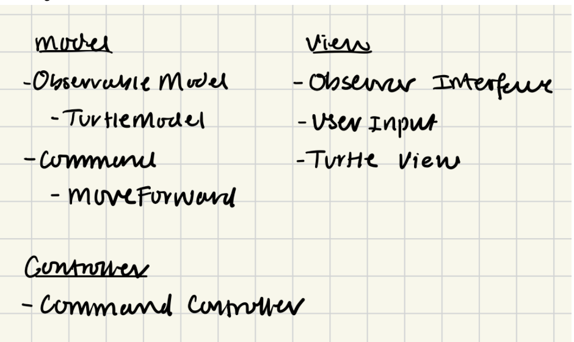
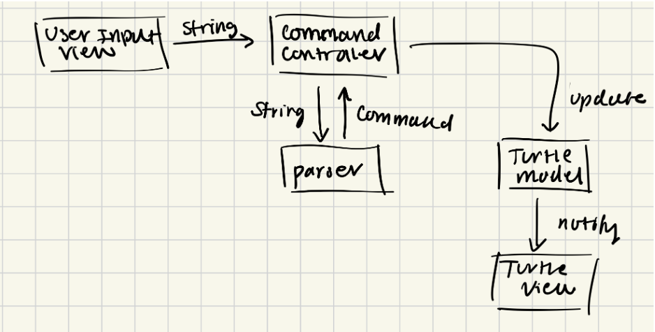

# SLogo Design Plan

### Philip Lee, Arnav Nayak, Connor Johnson, Prince Ahmed

### Team 2

#### Examples

Here is a graphical look at my design:


made from [a tool that generates UML from existing code](http://staruml.io/).

Here is our amazing UI:


taken
from [Brilliant Examples of Sketched UI Wireframes and Mock-Ups](https://onextrapixel.com/40-brilliant-examples-of-sketched-ui-wireframes-and-mock-ups/).

## Introduction

* For this project, we plan to create SLogo, an application that provides an IDE to its users to
  type “SLogo” commands and control a turtle to create drawings. One primary design goal of this
  project is to allow our command interface to be as extensible as possible. This means adding new
  commands should be seamless. Another primary design goal of ours is to ensure our modules
  communicate properly with common design patterns. This means ensuring our APIs are properly
  defined and that we plan out our code.

## Configuration File Format

```xml

<commands>
  <command>
    <canonicalName>MoveForward</canonicalName>
    <description>Moves the turtle forward by the specified distance.</description>
    <example>MoveForward 100</example>
    <help>
      <parameters>distance: double</parameters>
      <returnValue>void</returnValue>
      <category>Movement</category>
    </help>
    <numberOfExpectedParameters>1</numberOfExpectedParameters>
    <implementingClass>MoveForwardCommand</implementingClass>
  </command>
  <command>
    <canonicalName>RotateRight</canonicalName>
    <description>Rotate the turtle clockwise by the specified angle.</description>
    <example>RotateRight 45</example>
    <help>
      <parameters>angle: double</parameters>
      <returnValue>void</returnValue>
      <category>Movement</category>
    </help>
    <numberOfExpectedParameters>1</numberOfExpectedParameters>
    <implementingClass>RotateRightCommand</implementingClass>
  </command>
</commands>
```

## Design Overview


Modules Separated into Model-View-Controller


Data flow when Command is executed

## Design Details

* We center our design around the Observer, Factory, Command and MVC design patterns. Our data
  structure representing the state of the turtle is TurtleModel, which will contain information on
  its position and orientation. This TurtleModel will implement the ObservableModel class. Each view
  that needs to listen for state changes can implement the Observer interface. In our design, the
  Turtle View will implement the Observer interface because it will need to listen for state changes
  in the TurtleModel. This observer design pattern allows the view to update automatically in
  response to state changes. The Command controller links our model with our view. It will be
  responsible for managing the flow of data when a command is run.

* The data flow of a command is outlined above. When a user inputs a string, the view managing the
  input will pass the string to the Command controller. The command controller will parse the string
  into a command with a Parser. In our design, each Command will implement the Command interface.
  Turning our requests into objects follows the Command design pattern. The command, when executed,
  will then update the state of the model (TurtleModel). This state change will automatically notify
  the Turtle View of the change, which will re-render the turtle.

* Our method signatures do not reveal the difference between different implementations for our data
  structure. For example, our design allows for any observer to subscribe to any observable model,
  which means that any view can update based on any state change.

## Design Considerations

* We emphasized DESIGN-20 (apply design patterns) in our planning because we wanted to push our
  design abilities by following common design patterns. After defining the functionality of the
  game, the design patterns we wanted to prioritize naturally presented themselves. This was because
  the design patterns exist to optimize a specific type of implementation. For example, the Command
  design pattern naturally makes sense here because we are creating commands to execute in our IDE.

* A design issue we faced was figuring out the data flow from the view to the model back to the
  view. Our plan was one of many discussed and each iteration had its own benefits and drawbacks.
  Again, we used the design patterns as a framework to guide our design choices. Another design
  issue was figuring out how to make our controller more extensible. Right now, our Command
  controller is very limited and does not incorporate any abstractions. We can change this in the
  future to allow for more flexibility.

## Test Plan

* Small, Single-purpose Methods: Decompose complex operations into smaller, single-purpose methods.
  This not only improves code readability and maintainability but also makes unit testing more
  straightforward, as each method does one thing and can be tested for that one behavior.
* Example Test Cases are below:
    * Feature: IDE Display (SLogo-56)
        * Happy Path:
            * Scenario: Launching the program.
                * Expected Outcome: The splash screen is displayed with options to select a
                  language, color theme, and start a new session.
                * Testing Support: Method calls to initialize the splash screen can be verified, and
                  parameters for language and theme selections can be programmatically set and
                  checked.
            * Scenario: Selecting a language and starting a new session.
                * Expected Outcome: A new IDE session opens with the selected language.
                * Testing Support: Verify the method that sets the language is called with the
                  correct parameter, and check the UI elements for the correct language display.
        * Sad Path:
            * Scenario: Attempting to start a new session without selecting a language.
                * Expected Outcome: An error message prompts the user to select a language.
                * Testing Support: Simulate the start action without a language selection and check
                  for the presence of the error message in the UI.
    * Feature: Turtle Graphics Window (SLogo-58)
        * Happy Path:
            * Scenario: Executing a "forward 50" command.
                * Expected Outcome: The turtle moves forward by 50 units, and a line is drawn.
                * Testing Support: Invoke the command execution method with "forward 50" and verify
                  the
                  turtle's new position and the drawing on the canvas.
        * Sad Path:
            * Scenario: Executing an invalid command.
                * Expected Outcome: No change in the turtle's position or graphics window; an error
                  message is displayed.
                * Testing Support: Try executing an invalid command and check for no change in the
                  turtle's position and the presence of an error message
    * Feature: Interactive Command Prompt (SLogo-59)
        * Happy Path:
            * Scenario: Inputting a valid command sequence.
                * Expected Outcome: Commands are executed in order, and results are visualized.
                * Testing Support: Input a sequence of commands via the command prompt method and
                  verify
                  the execution order and visual output.
        * Sad Path:
            * Scenario: Inputting a command with incorrect syntax.
                * Expected Outcome: The command is not executed, and an error message is shown.
                * Testing Support: Input a command with incorrect syntax and check for the absence
                  of
                  execution and the presence of an error message.
    * Feature: Command History View (SLogo-60)
        * Happy Path:
            * Scenario: Successfully executing multiple commands.
                * Expected Outcome: The command history updates with each executed command.
                * Testing Support: Execute a series of valid commands and verify that the command
                  history UI
                  component reflects these commands accurately.
        * Sad Path:
            * Scenario: Executing a mix of valid and invalid commands.
                * Expected Outcome: Only valid commands appear in the command history.
                * Testing Support: Execute a mix of valid and invalid commands a

## Team Responsibilities

* Prince
    * Primary: View

* Philip
    * Primary: Controller/Observer

* Arnav
    * Primary: Model
        * TurtleModel/ObservableModel
        * Command Interface

* Connor
    * Primary: Parser
